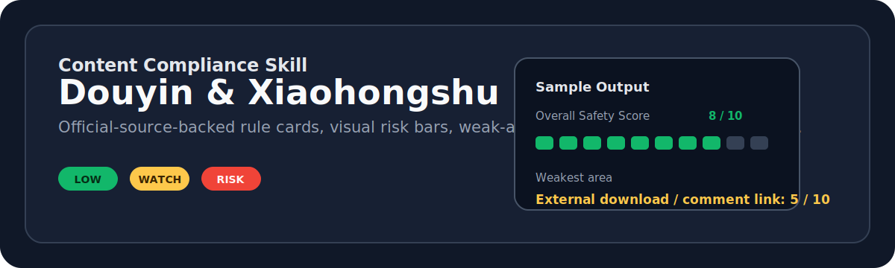

# Content Compliance Skill



<p>
  <a href="https://github.com/zexuanw958-svg/content-compliance-skill"></a>
  
  
  
  
</p>

面向自媒体创作者的 Codex / Claude Code 合规检测 Skill。它会在选题、口播稿、画面描述、评论区话术和投放计划发布前，按抖音、小红书及其商业化场景的官方来源规则做一次结构化风险审查。

中文名建议：**内容合规检测**。日常可以直接叫它：`检测`、`合规检测`、`/检测`、`/content-compliance`。

## Why It Exists

自媒体内容最麻烦的地方不是“能不能写”，而是风险经常藏在局部：

- 选题本身没问题，但评论区话术变成了领取链接。
- 普通发布问题不大，但一投 DOU+ / 薯条 / 巨量引擎就进入更严格的审核语境。
- 整体稿子看起来健康，但某一句“下载第三方工具”把风险拉高。

这个 Skill 的目标不是替代平台审核，而是把这些局部风险提前标出来，让创作者在发布前有一张清晰的体检单。

## What It Reviews

| Review Area | What Gets Checked |
| --- | --- |
| Topic gate | 选题是否适合继续生产，是否提前埋下导流、夸大、强监管行业风险 |
| Draft review | 标题、口播、正文、字幕、评论区、私信、画面描述和发布说明 |
| Promotion context | DOU+、巨量引擎、薯条、蒲公英、聚光等商业化或投放场景 |
| External guidance | 评论区拿链接、私信领取、二维码、外链、第三方下载、跳转路径 |
| Regulated industries | 金融、医疗、教育、食品药品、未成年人等强监管领域提示 |

## Output Preview

```text
Recommendation: 修改后再发布；如果计划投放，不建议保留“评论区拿链接”和直接下载引导。

Total Risk Score: 3/10
Risk Bar: 3/10 🟩🟩🟩⬜⬜⬜⬜⬜⬜⬜

Overall Safety Score: 8/10
Safety Bar: 8/10 🟩🟩🟩🟩🟩🟩🟩🟩⬜⬜

Weakest Areas:
- external_guidance_download_comment_private_message_or_qr: 5/10
  Evidence: “完整教程和工具地址，我已经放在评论区了。”
  Fast Fix: 改成“工具名称和注意事项我会整理出来，使用前请自行核对官方仓库和安全风险。”
```

The score is intentionally split into two views:

- **Total Risk Score**: 1-10, higher means riskier.
- **Overall Safety Score**: 1-10, higher means safer.
- **Layer Safety Dashboard**: the weakest local area is scored separately, so one risky CTA does not get hidden behind an otherwise safe script.

## Install

Copy the skill package into your local skill root:

```bash
cp -R content-compliance ~/.codex/skills/
cp -R content-compliance ~/.agents/skills/
```

Use `~/.codex/skills` for Codex. Use `~/.agents/skills` for agent runtimes that read that shared skill root.

## Invocation

Natural Chinese triggers:

```text
检测
合规检测
内容合规检测
帮我审一下抖音选题
帮我查一下小红书稿子风险
```

Slash aliases, where supported:

```text
/检测
/content-compliance
```

If a runtime does not support non-ASCII slash-command names, use `/content-compliance` or ask naturally in Chinese.

## Package Structure

```text
content-compliance/
  SKILL.md                         # Main workflow and trigger instructions
  rules/                           # Official-source-backed rule cards
  scoring.md                       # Risk score, safety score, and visual bar logic
  templates/report.md              # Required report structure
  references/                      # Official source inventory and research notes
  examples/                        # Expected report shapes for Douyin and Xiaohongshu
  scripts/validate_skill.py        # Package validator
tests/
  test_content_compliance_skill.py # Regression tests for sources, examples, scoring, and template
```

## Validate

```bash
python3 content-compliance/scripts/validate_skill.py
python3 -m unittest tests/test_content_compliance_skill.py -v
```

Validation note:

This repository intentionally keeps `content-compliance/README.md` inside the skill package because the package is meant for public distribution and standalone inspection. Some generic skill-creator validators prefer no `README.md` inside a skill folder and may warn about this. For this project, use the bundled validator and test suite above as the source of truth.

## Design Notes

The README structure follows common open-source documentation patterns: a clear first-screen summary, quick installation, usage examples, feature tables, validation commands, and explicit project limitations. The visual style is intentionally restrained so it looks clean in GitHub and in screen-recorded video demos.

## Disclaimer

This skill is a compliance reference tool, not an official review tool. It does not guarantee publishing approval, ad review approval, traffic delivery, account safety, or legal compliance. Platform rules and review practices may change with time, account status, content context, and enforcement interpretation. Users remain responsible for checking current official rules and for their own publishing, promotion, advertising, and legal decisions.
